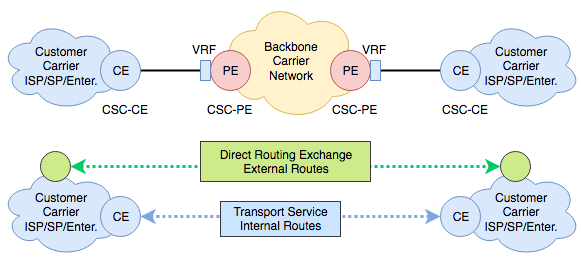
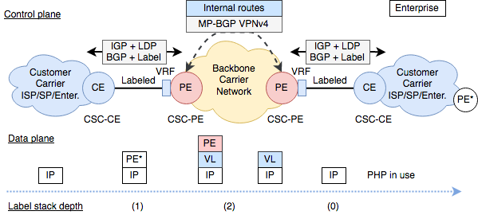
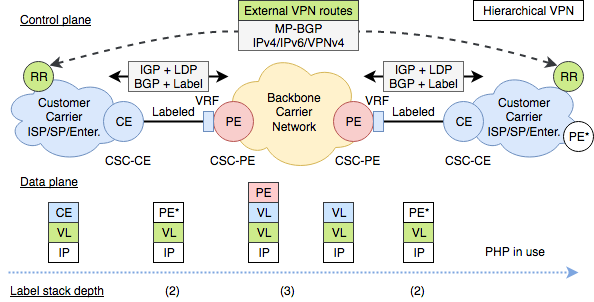

# Carrier Supporting Carrier

Carrier Supporting Carrier (CsC), Carrier’s Carrier or Hierarchical MPLS is an architecture designed to expand the MPLS core in a hierarchical way.

CsC defines a hierarchical architecture that is very similar to Tier levels in ISP architectures. If a SP has no extended coverage on a wide geographical area needs to purchase transport services to another SP.

CsC defines a hierarchical scalable and modular architecture that unveils the MPLS power and flexibility at its most, but is not as popular as L2 connectivity services for SP interconnection. Every SP may have their own reasons to discard CsC as a connectivity service, but may be some common reasons:

* CsC is complex from an operational point of view
* L2 connectivity services are easier to configure and troubleshoot
* Security may be a major concern because internal routes are partially leaked

Let’s take a brief look at the architecture and two use cases: Enterprise and Hierarchical VPN.

# Architecture

The CsC architecture defines the next elements (please check RFC 4364 for more details):

* Backbone carrier
* Customer carrier
* CSC-CE: CE located in the customer carrier
* CSC-PE: PE located in the backbone SP and carries customer SP routes (internal routes)
* PE: PE located in the customer carrier and carries customer routes (external routes or VPN routes)
* RR: route reflectors located at the customer carrier

The Backbone Carrier joins Customer Carrier isolated islands. In case the Customer Carrier runs MPLS, transporting internal routes between sites allows for end-to-end LSPs between Customer Carrier sites.

Once the LSP continuity is assured, VPN services (in case of Hierarchical VPN) can easily be extended between Customer Sites. The Backbone carrier is agnostic to the direct routing exchange of external routing information (VPN routing).

CsC can be chained. In that case is important to keep into account that the label stack increases and that may be a problem if the MTU is not adjusted accordingly.

# Enterprise

CsC may suit the needs of large enterprises with the need of transporting large number of routes between remote locations. The Customer Carrier in this case could be an Enterprise running IP or MPLS/IP networks.

The Backbone Carrier role is very similar to the one of an SP offering MPLS L3 VPN services, with a difference: the link between the CSC-PE and the CSC-CE is labeled. There are some options to implement labeling:

* IGP (OSPF, RIP, EIGRP, IS-IS, Static) + LDP
* BGP IPv4 + Label

The Backbone Carrier will transport internal routes between sites, allowing IP connectivity. If no further routing exchange is performed (detailed in the next point), the VRFs in the CSC-PE store all the exchanged routes as in the MPLS L3 VPN service.

# Hierarchical VPN

This is the case when the Backbone carrier is providing connectivity for SP sites offering MPLS L3 VPN services to their clients.

Backbone Carrier transport reachability between endpoints allows for LSP continuity between customer carrier sites (internal routes reachability information). Customer Carrier uses Backbone Carrier MPLS L3 VPN services hierarchically and that is the reason for the “Hierarchical VPN” name: MPLS L3 VPN backbone carrier has VPN customers that provide VPN service to their customers.

In addition to the exchange of internal routing information discussed in the previous point, the Customer Carrier needs to exchange their customer’s routes (external routes, VPN routes) between their sites to provide end-to-end VPN service. 

In this case it uses the Backbone Carrier as a transport service for the internal routes and perform direct exchange of external routing information between SP sites by using MP-BGP VPNv4.

For Hierarchical MPLS to work, all Customer Sites (SP sites) must run MPLS/IP.

# Summary

* CsC is a hierarchical scalable VPN “transport” service 
* CsC supports a wide range of service extension
  * MPLS L3 VPN (IPv4 and IPv6)
  * MPLS L2 VPN
  * Multicast VPNs
* CsC is a modular service.
* For each ‘Tier’ level (CsCsC…)
  * External routes: VPN reachability information of customer carrier is transparent to the backbone carrier.
  * Internal routes: Backbone carrier is aware of internal customer carrier next-hop reachability information.

