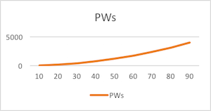
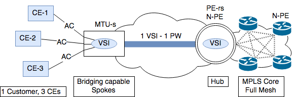
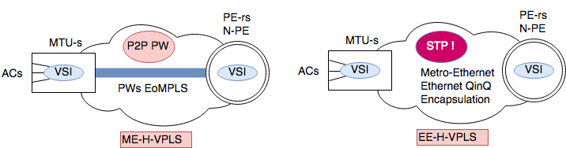
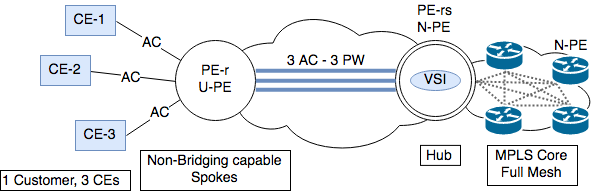
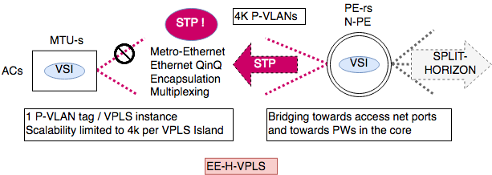

# H-VPLS fundamentals

VPLS is a LAN emulation service designed to operate over MPLS networks. It emulates L2 broadcast domains that can span between customer sites, interconnecting different sites as if they were connected to a virtual switch.

There is two IETF standards covering the two possible implementations of the VPLS signaling, one using BGP (RFC4761) and the other using LDP (RFC4762). The two implementations have their particular characteristics and tradeoffs from the perspective of network design, but this is out of the scope of this document.

VPLS with LDP signaling will be discussed here.


## Scale limiting factors

There are two fundamental scale limiting factors of plain or flat VPLS architectures:

* Signaling overhead
* Packet replication

There is no hierarchical scalability in flat VPLS design because full mesh of directed LDP sessions is required between PE devices. That means that we need  ```(N*(N-1))/2``` PW for ```N``` PE devices in the network and that represents a lot of signaling overhead. Clearly that represents a scalability problem in the state of the control plane as the number of PE grows.



Packet replication overhead is another scaling limiting factor of VPLS because packet replication consumes CPU resources and a lot of bandwidth may be needed to support any kind of packet replication (unknown unicast, multicast or broadcast) over the same physical interface.


## Hierarchical connectivity

Hierarchical connectivity architecture reduces signaling and replication overhead, allowing H-VPLS be deployed in high scale service provider scenarios.

H-VPLS defines a two level hierarchy of a hub (N-PE) and spoke (U-PE, MTU) topology.


## H-VPLS components

H-VPLS introduces new roles in the network devices that is convenient to discuss previously to the design considerations in order to get a more complete understanding of the functionality of each block in the hierarchy.


 | Device | Location | Capabilities | Encapsulation Technologies |
 | :-: | :-: | :-: | :-: |
 | PE-rs <br/> (N-PE)  | Core | Routing <br/> Bridging | PWs <br/> QinQ (edge-facing) |
 | MTU-s | Edge | Limited routing <br/> Bridging | PWs <br/> QinQ |
 | PE-r <br/> (U-PE) | Edge |  Routing | PWs |


This elements interact in a way it will be introduced here to provide a two-level hierarchical architecture that intends to smooth scalability problems of the LAN emulation service.

> The PE-rs or U-PE will make the function of a gateway between the MPLS core with the full mesh of PW requirement and the edge domain. In the edge, MTU-s and PE-r devices will extend the VSI or provide access to it to the customer end CE devices.


## H-VPLS Hub and Spoke design

The next table reflects the influence that may have on the network design the transition from plain to hierarchical hub & spoke topology at the edge in H-VPLS.

|   | VPLS | H-VPLS |
| :-: | :-: | :-: |
| Full mesh | Full mesh from the edge of the network | Only needed at the core between N-PE |
| Signaling overhead  | Potentially high signaling overhead |  Minimized signaling overhead |
| Packet replication  | Done at the edge  | Done at the core |
| Packet bridging  | Done at the core  | May be done closer to the edge |
| Opex | High impact as all core devices need to be configured if a new element is added  |  The operational overhead of adding new MTU-s or U-PE is controlled to an area |


## Hierarchy

From the hierarchical point of view, the spokes functions may be implemented by bridging and non-bridging capable devices. There are some functional, architectural, scalability and operational points that need to be considered depending on the selected option:


 | | Bridging capable | Non-bridging capable |
 | :-:  | :-:  | :-:  |
 | Local MAC address learning | Yes | No |
 | Local bridging | Yes | No |
 | Unknown destination replication | All ports | No replication |
 | Signaling | 1 PW per VSI instance | 1 PW per AC |
 | Signaling overhead | Lower | Higher |
 | Encapsulation | PW <br/> QinQ | PW |  
 | Multiplexing | Yes, over PWs and Ethernet (QinQ) | No |


### Bridging capable spokes (MTU-s)

For each VPLS service, one PW is set up between the MTU-s and the PE-rs. Since is bridging capable, only one PW is needed per VSI, independently of the number of ACs in the same VPLS service instance. This reduces signaling.

Spoke PWs terminate on the VSI instances on the MTU-s and PE-rs.

Packets to unknown destinations are replicated to all ports associated to the same VSI (local ACs and _the_ PW). Once MAC addresses are learned, switches the traffic locally, saving bandwidth in the path to the hub.



If the MTU is directly connected to the PE-rs, other encapsulation techniques, like Ethernet QinQ may be used.



Bridging capable spokes perform multiplexing of ACs in one unique PW per VSI instance and of multiple client VLANs when using QinQ encapsulation.


### Non-bridging capable spokes (PE-r)

It needs to set up 1 point to point PW per AC that terminates on the VSI of the PE-rs, independently if the AC is assigned or not to the same VPLS instance. Adds more signaling overhead than using bridging capable MTUs.

No MAC address learning and frame replication on PE-r devices. All the traffic received on the AC is forwarded to the PE-rs via the PW. All the traffic received on the PW is forwarded to the corresponding AC. The traffic is NOT local switched at the PE-r, is forwarded to the PE-rs and switched there.




> H-VPLS with non-bridging capable spokes has some advantages, like the capability of being able to offer VPLS service in conjunction with a routed service without the need of adding new devices or MTUs to the hierarchy.


## Ethernet at the edge design considerations

If the service provider has an Ethernet network already deployed on the edge, this network could be used to provide to existing customers VPLS services.




To avoid depending on customer VLAN tagging overlapping, 1 new VLAN tag (P-VLAN or Provider VLAN) is assigned per VPLS instance to non-multiplexed ACs. That assignment limits the number of VPLS instances per metro-ethernet island to the maximum number of different VLANs (4K).

The PE-rs device performs the binding of the VSI towards ethernet access network ports on one side, and towards the full mesh of PWs in the MPLS core.

The PE-rs should apply split horizon rules to the PWs and should participate in the STP instance that probably will be running edge-facing.


# References

* [RFC4664][4664] Framework for L2VPNs
* [RFC4762][4762] VPLS Using LDP

[4762]:<https://tools.ietf.org/html/rfc4762>
[4664]:<https://tools.ietf.org/html/rfc4664>

