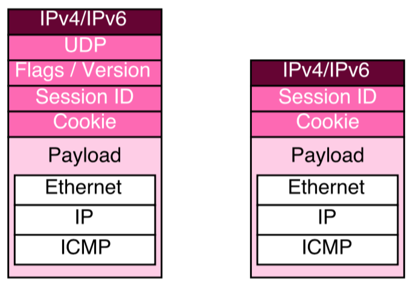

# L2TPv3 encapsulation

L2TPv3 has two modes of operation depending on the packet encapsulation format selected: IP or UDP.

**L2TPv3 over IP** uses a dedicated IP protocol (115) value to carry L2TP data without the overhead of UDP and should be used when there are no NAT devices or firewalls in the network path.

**L2TPv3 over UDP** uses the IP protocol id of UDP (17) and was introduced to support better NAT and firewall traversal, so it should be used when in our scenario there are some devices performing that functionality.

  

**L2TPv3 control packets get an additional benefit when running over UDP**. The IP checksum is limited to the IP header, but the UDP checksum is designed to check end to end errors, covering the pseudo header and the UDP datagram, including the source and destination IP address to add protection against misdelivery.

# Linux implementation details

When an L2TPv3 Ethernet session is created, a virtual network interface is created for the session, which must then be configured and brought up, just like any other network interface. When data is passed through the interface, it is carried over the L2TP tunnel to the peer. 

By configuring the system's routing tables the L2TP interface is like a virtual wire (pseudowire) connected to the peer.

# References

* https://tools.ietf.org/html/rfc3931
* http://man7.org/tlpi/
