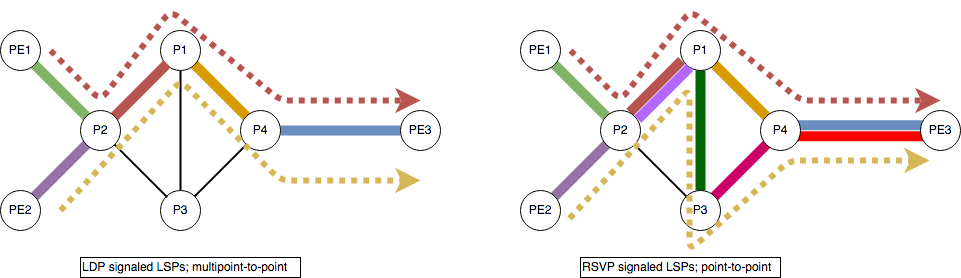

I want to share some brief notes about two protocols used for setting up the LSP in MPLS enabled core networks: LDP and RSVP. Both protocols have some important differences that should be understood to dig deeper into protection and restoration mechanisms as well as DiffServ-aware TE.

# LDP vs RSVP

There are three protocols commonly used for the distribution of label bindings in MPLS networks:
* LDP
* RSVP
* BGP

Exists multiple extensions to IGPs that enable that protocols to distribute labels as an addition to perform classical routing functions on the network. That extensions are not commonly used in real deployments, so are not going to be covered here.

## LDP

Of the three, LDP is the youngest one. Was created explicitly to distribute labels and it’s not an extension or added functionality to a relatively old protocol like in the RSVP or BGP case.

LDP is designed to be highly extensible, using TLV triplets to be able to transport multiple additional fields in the future and warrantee the compatibility with previous versions via ignoring the unknown new fields.

LDP is highly flexible, as supports local and remote neighbors (using targeted LDP sessions). This flexibility allows an LSR to exchange label information with local and remote peers which enables it to support the engineering of multiple services and functionalities like LDP session protection.

LDP is a reliable protocol, because it uses TCP as transport. Only the neighbor discovery and maintenance is performed using UDP. The incremental updates functionality is a point in favor of its scalability.

If LDP is so reliable, extensible, functional and scalable, why do we even think about using an alternative to it in the MPLS core to do the job of setting up the labeled switched paths? Well, it follows the leader blindly and that may, under some circumstances, be a problem like may be in real life.

LDP follows the IGP in the decisions the later takes. The price to pay for that decision is loss of stability of the LSPs that LDP set up.

* Instability: if the IGP changes, the LDP will change with it, but late. LDP could set up instable LSPs in the network.

* Convergence: the convergence events that happens on every network are inherited by LDP and that could lead to data loss or looping conditions. The convergence time of the IGP will set a lower convergence time limit to LDP and to the LSPs (not considering LDP FRR capabilities yet).

* Race conditions: race conditions may always appear when two protocols interact in an unsynchronized way, and that may leads to data loss.

## RSVP

~~Please, I need you to complete this section with a similar approach :) so that we can compare yours with mine.~~

Originally, the RSVP protocol was developed to support the IntServ QoS model resource reservations for each flow that demands specific QoS requirements as it traverses the network. Original RSVP does not scale very well because the number of end to end sessions that the intermediate devices must support may grow very fast in the SP core as more flows require QoS reservations, and that affects the control plane state that devices must support.

RSVP was extended to support the creation and maintenance of LSPs, as well to being able to make bandwidth reservations for the signaled LSPs. The extension performs scalability by aggregation, but… of what? It aggregates multiple flows of data into one LSP in a way that 1 RSVP session set up 1 LSP that can transport multiple flows of data. As the amount of state on each node of the network is proportional to the number of LSPs traversing the node, aggregation alleviates (that does not solve) the problem of scalability.

The path reservation is initiated by the ingress LSR using Path and Resv messages. The Path message travels from ingress LSR (head-end) to egress LSR (tail-end) and the Resv in the opposite direction.

* RSVP Path 
  * Label request
  * ERO (Explicit Route Object, explicit route)
  * RRO (Recorded Route Object, loop avoidance)
  * Tspec (Bandwidth Reservation, QoS requirements)
  
  
* RSVP Resv
  * Label object (Assigned Label)
  * RRO (Loop avoidance)

The LSP reservation need to be refreshed periodically via Path and Resv messages from the head-end to the tail-end. The Summary Refresh Extensions of RSVP allows the refresh of multiple LSPs at once in a way that the number of signaling messages for refreshing LSPs that share the same path may be reduced.

There is no concept of ECMP in RSVP once the traffic in tunneled over the core in the tunneled LSP. In case the applications or business requirements mandate for the need of multiple different paths, the ingress LSR or head-end should ask for multiple reservations and split the traffic over the two (or more) LSPs. Of course, the ingress LSR may ask for as many reservation as it needs for the applications, but at the cost of more state in the control plane of all the devices the LSP crosses.

Finally, for good or not, RSVP does not follow the IGP, and that allows the head-end to take independent decisions about the traffic flows it reserves.

## When to use which one?

Keeping things simple, LDP should be used every time the advanced features of RSVP are not needed or not to be used. LDP is a much simpler protocol by design and it’s easier to provision, operate and scale. The operational expenses of using LDP should be lower than in the case of RSVP even in the case of a slow growing network.

When traffic engineering capabilities are mandatory or fast restoration services must be supported, then RSVP should be the way to go. RSVP allows explicit path and bandwidth reservation for the LSPs, and that allows the service providers to offer and sell non-aggregated bandwidth data access to their customers. Fast restoration capability should be used to support business needs for real time applications, high sensitive to long path or node restoration times.

## LSP design attributes

| | LDP | RSVP-TE |
| :-: | :-: | :-: |
| Easy of configuration, operating and troubleshoot (OPEX) | Easy | Hard |
| FRR capabilities | No | Yes |
| ECMP | Yes | No |
| Traffic Engineering | No | Yes |
| BW reservation | No | Yes |
| Transport | TCP | IP |
| State (refresh) | Hard | Soft |
| Scalability | High | Medium |
| LSPs topology | Multipoint-to-point | Point-to-Point |

## LSPs _topology_

