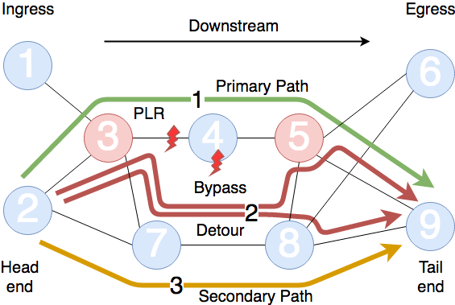
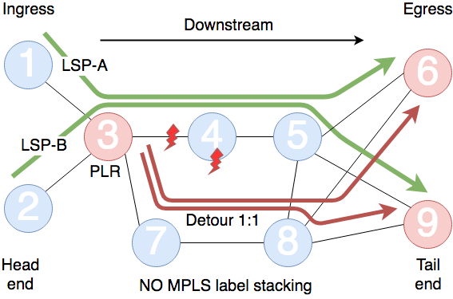
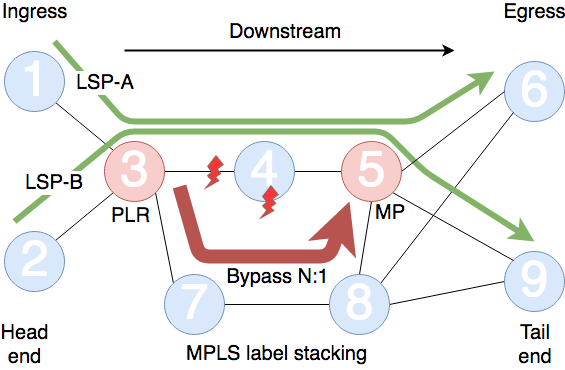

# MPLS-TE FRR

RSVP-TE extensions allows for local repair of LSP tunnels. The protection LSPs allows for immediate redirection of traffic onto backup LSPs just after detecting the failure. The objective here is the same as IP FRR but it applies to explicitly routed LSPs.

There are two methods for providing protection:

* One-to-one (1:1) backup: creates one detour LSP per protected LSP at each potential PLR
* Facility (N:1) backup: creates a bypass LSP to protect all LSPs with similar backup constraints

Both methods can co-exist and protect links and nodes during failure

# Business needs

Service provider MPLS enabled cores need to fulfill the requirements of real-time applications with tight end-to-end QoS requirements. MPLS FRR:

* Allows fast protection switching to the protection LSP in 10s of msec.
* Needed for real time traffic as voice
* Make applications unaware of failures in the core infrastructure

# The goal of a Faster convergence

To be able to provide faster convergence it’s convenient to compute and signal backup LSPs in advance to failure events and set the traffic redirection point as close to the failure as possible.

Following a failure, the traffic is switched immediately to the backup LSP (2) and a new optimal computation may be triggered by the head end. When the computation of the new optimal path finishes, the traffic may be switched to it (3).

The advantages of this approach are that there is no failure signaling delay to the ingress of the LSP to be able to calculate an alternate path and there is no new path computation delay.

# One-to-one protection

* Detour LSP
* One different LSP per LSP backed up
* The backup LSP intersects the original LSP at some point downstream
* Poor scalability because the number of LSPs for full protection may be potentially high
* The size of the label stack does not increase
* Leads to more optimal paths

# Facility protection

* Bypass LSP
* One bypass tunnel is used to back up a set of LSPs
  * It uses the MPLS label stacking to tunnel multiple LSPs into one
* LSPs backed up must share the PLR and a downstream node, the MP
* High scalability due to the sharing of the protection tunnel
* It increases the size of the label stack, as another label is pushed at the PLR
* May lead to suboptimal paths because of the common MP for all tunneled LSPs

# One-to-one vs Facility protection

| | One-to-one backup | Facility backup |
| :-: | :-: | :-: |
| Type of traffic protection | Detour | Bypass| 
| Aggregation of LSPs | 1:1 | N:1 | 
| Protection LSPs signaling | At each hop | At each hop | 
| LSP protection sharing | Disallowed | Allowed |
| MPLS label stacking | No label stacking | 1 more label added to the stack |
| Scalability | Poor | High |
| Control plane | Different state per protected LSP | One tunnel per group of protected LSPs |
| Data plane | Different forwarding information per LSP | One label per protection LSP |
| Protected path quality | More optimal paths | May lead to suboptimal paths |
| Individual protection LSP granularity | Possible | Not available |
| Merge Point | At some point, downstream | Next device passed protected resource |
| Optimality | More optimal paths | Suboptimal paths | 
| Path selection criteria for individual paths | Possible | Not possible | 

# Summary

* FRR capabilities for MPLS environments
* It buys some time for recalculation and setup of explicitly routed LSPs after failure (route around the failure first, calculate an optimal path later)
* Two modes, facility and one-to-one protection modes
* Both methods can protect links and nodes during failure

