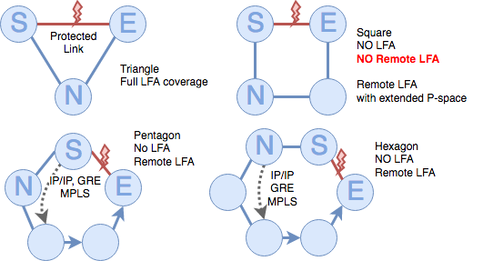
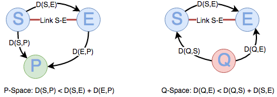
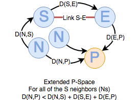
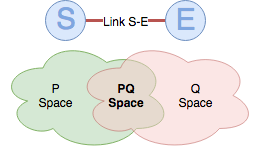

# Remote LFA FRR

LFA covered in RFC 5286 provides good protection for links in highly meshed topologies where may be relatively easy to find an alternate loop free path to the destination. 

Unfortunately, for poorly meshed and ring topologies, the link cannot be protected by the LFA mechanism alone, and it is convenient to use an alternative method.  The problem in these cases is that there is no neighbor of the point of local repair (PLR) that has a cost to the destination via a path that does not traverse the failure cheaper than the cost via the failure.

RFC 7490 explains the mechanism for tunneling the packets that require IP FRR to a node that is both reachable from the PRL and can reach the destination.

# Topology dependency

LFAs are very dependent on the network topology and more specifically on the degree of meshing. The next figure shows the LFA coverage for four different network topologies.

|  | Triangle | Square | Pentagon | Hexagon |
| :-: | :-: | :-: | :-: | :-: | 
| LFA | Yes | No | No | No | 
| Remote LFA | Yes | No | Yes | Yes | 
| Remote LFA P-extended | Yes | Yes | Yes | Yes | 

# Repair paths

As in the case of IPFRR, repair paths are precomputed in advance so they are ready to be immediately used after a failure is detected in the network. Remote LFA FRR is a virtual loop-free alternate that may complement physical (not tunneled in this context) LFAs. Tunneled repair paths are needed only for links that do not have a link or per-prefix LFA. As LFA repairs do not require the setup of tunnels, this should be always the preferred option for efficiency and simplicity of the solution.

A tunneled repair path tunnels the traffic to some intermediate (in terms of distance) point in the network from which is known that, in the absence of any other failure, the traffic will be forwarded to the final destination without looping back. Any tunneling encapsulation mechanism can be used: IP in IP, GRE tunnels or MPLS LDP.

The repair tunnel objective is to move away the traffic from the source in a way that the traffic don’t return back to the source traversing the failed link to reach the destination. 

Repair tunnel endpoints must be reachable from the tunnel source without traversing the failed link and traffic must proceed towards their destination without being attracted back over the failed link. These are two important properties and ensure packets will not loop after a single link failure.

# Computation of the repair paths

P-space
* {P} / D(S,P) < D(S,E) + D(E,P)
* P-space is calculated as SPT rooted at S, excising subtree via S-E.
* For LDP tunneling to success

Q-space
* {Q} / D(E,Q) < D(Q,S) + D(S,E)
* Q-space is calculated as the reverse SPT (rSPT) rooted at E, excising subtree via S-E
* For the traffic going ‘directly’ towards destination

Extended P-space:
* Union of P-spaces of S neighbors
* Extended P-space is calculated as STP rooted at each neighbor N of S, excising subtree via N-S-E.

PQ-space
* Intersection of P-space and Q-space
* Defines the set of viable repair tunnel endpoints, known as PQ-nodes

Routers reached via ECMP are always excluded to prevent the forwarding subsystem to execute repairs via the failed link

In the case we need to setup tunneling and use rLFA techniques, the repair tunnel endpoint with the shortest cost to the source should be considered to be used. Choosing the closest maximizes the opportunity for the traffic to be load balanced once it has been released from the tunnel.

# Deployment and applicability

Remote LFA is suitable for extending an existing network with LFA already deployed to extend the coverage of the protection. This is an advantage from the operational point of view, as there is no need to deploy the functionality on the whole network or use it to protect every possible link.

In the case of MPLS LDP, the tunneling is very easy to implement in the case the core is already MPLS enabled, which is a fairly common case. The LSP from the source S to the repair tunnel endpoint (a PQ node) is already available so it does not require any new protocol or design change.

From the data plane perspective, only an additional label is needed for the tunneling of the traffic from the source to the remote LFA. In the control plane, a targeted LDP session is needed between the repairing node and the repair tunnel endpoint. This session need to be established and the labels processed before the tunnel can be used.

Because the targeted LDP session, the label exchange and processing of the labels make take a relatively long time, the repair tunnel must be provisioned in advance to the failure and be ready to be used.

# Summary

* Remote LFAs improve the LFA coverage in ring and poorly meshed topologies.
* It’s important the consistency in selecting the remote tunnel endpoint.
* May work with RSVP with very little operational and computational overhead.
* RSVP can be used to complement LFA/rLFA and vice versa.
* When used in conjunction with MPLS LDP, there is no need of additional protocols in the control plane.
* The data plane for MPLS make use of label stacking to tunnel the packets to the PQ node and from there, traffic will flow to the destination without returning to the source or traversing the protected link.

