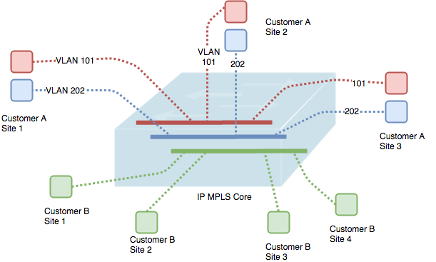
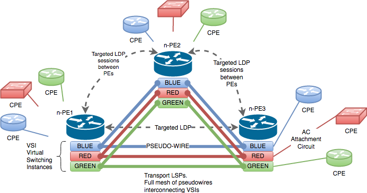
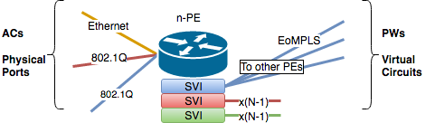
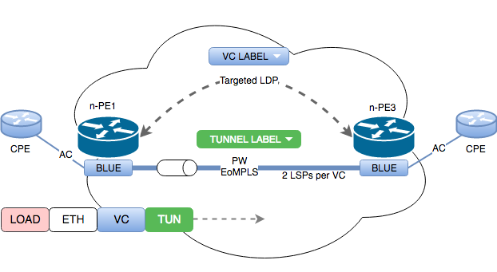

# What is VPLS ?

Virtual Private LAN Service (VPLS) is an MPLS L2 VPN technology that **emulates** a single LAN segment shared between customer sites. It emulates a broadcast domain using as a transport a service provider MPLS network.

Because it's a MPLS based service, it inherits some of the improvements related to it, like traffic engineering (MPLS-TE) and improved resilience.

VPLS is a point-to-multipoint service, so must emulate regular LAN switching features. From customer perspective, all the MPLS network can be seen as a configurable Ethernet switch.





# Switch emulation

Ethernet functionality that must be emulated by the VPLS service may be grouped in 3 big blocks: frame forwarding, dynamic MAC address learning and loop prevention mechanism.

* Frame forwarding
  * Unicast
    * Known destination
    * Unknown destination
  * Multicast
  * Broadcast


* Mac address table
  * Mac address learning
  * Mac address aging


* Loop prevention mechanisms

> AToM is based on interface based forwarding.
> VPLS emulates a bridge using IEEE 802.1Q Ethernet bridging.


# VPLS architecture

VPLS architecture allows service provider MPLS networks to offer L2 point-to-multipoint services emulating Ethernet switches. The basic components of the VPLS architecture are:

* AC (attachment circuit): connect the PE device to the CE. It could be physical or a logical Ethernet port (802.1Q).

* VSI (Virtual Switching Instance, aka VFI or Virtual Forwarding Instance): the VSI is the unit of emulation service.

* VC (virtual circuit): identify the VSI.

The figure shows the major components of the VPLS direct attachment mode.





## Frame forwarding

Each customer connection need to be associated to a VSI. Multiple VSIs will be interconnected using pseudowires defined over the MPLS network, creating a full mesh of EoMPLS VCs (2 LSPs per VC) per VPLS instance.

Each VSI learn the origin MAC addresses and the ports on which frames are received. The dynamic learning of MAC addresses is done on physical ports and VCs for each VSI.





With the information on the VSI table, the PE forwards the Ethernet frames emulating a standard switch.

It is possible to handle tagged or untagged traffic on the physical interfaces. In the case of tagged traffic, one VSI per VLAN can be used to isolate broadcast domains.

> Overlapping between customer VLANs is supported, as every customer traffic will be managed by a different VSI.


## MAC address learning & withdrawal

PE routers of the VPLS network should perform MAC address learning and aging:

* Learning: the PE device will learn source address (SA) received and will associate that SA with a physical port or VC.

* Aging: the MAC addresses bay be aged out after a certain period of time if the device don't receive any frame with that SA MAC address. As it happens with a regular switch, the timer is refreshed with new frames on the physical port or VC.

* Withdrawal: in case of disconnection or failure, the PE removes locally learned MAC addresses on the port and sends LDP address withdrawal to the remote PEs.


## Loop prevention

To avoid looping of frames inside the MPLS network some rules must be set:

* Full-mesh topology of pseudowires interconnecting the VSIs (PE).
* Split horizon rule for the traffic received over the PW.

Split-Horizon mechanism is **ON** by default to avoid L2 frame loops inside the MPLS core.

> Split-horizon in this scope means that a L2 frame received by a PE over a pseudowire should not be sent over any other pseudowire.

With full mesh requirement, there is no need of STP instances in the service provider network. Every x-PE sees itself as the root of the "tree". The customer BPDU can be forwarded transparently between sites.

The split horizon rule assures that traffic received from the network won't be sent back to the network.


# Control plane

To provide VPLS service over the MPLS enabled network, the control plane must setup the bidirectional tunnels (2 unidirectional LSPs) between the PE devices using some label distribution protocol like LDP.

To being able to link different VSI at different locations to a common Ethernet virtual segment, the PEs need to interchange one more label for the VSI, the VC label. VC labels can be distributed by targeted LDP sessions or using BGP.

* Tunnel label is distributed by LDP
* VC label can be distributed by
  * Targed LDP (directed LDP)
  * BGP

The targeted LDP session it's used to implement MAC address withdrawal when a PE device removes a locally learned MAC address.




# Data plane


VPLS service impose two labels to the Ethernet frames before they are forwarded over the MPLS core:

* VC label (or wire emulation label) identifies the VFI. Is used to identify the AC (Ethernet port or VLAN interface) the frame will be forwarded into.

* Transport label (or tunnel label) identifies the LSP the frame belongs to.

The VC label is used as an indicator to the VC the frame belongs to. Transport label is used to forward the frame from the ingress PE to the egress PE.

> The transported frame is an Ethernet frame without 802.1Q tag. If the Ethernet frame is tagged, the tag is removed before sending the frame into the MPLS network.


# Basic configuration using IOSv

These are some basic steps for configuring a PE to provide VPLS service to customers.

> At the moment of this writing, you can configure this functionality using IOSv devices, but the solution won't work on the data plane. You can verify the control plane setup though.


Configure a VPLS instance (VFI)

```PE(config)# l2 vfi <vfi-name> manual```

Specify a unique VPN ID number for that VFI.

```PE(config-vfi)# vpn id <vpn-number>```

Configure neighbors of the created VFI. All the egress PE must be configured as neighbors for the VFI.

```PE(config-vfi)# neighbor <router-id> encapsulation mpls```

Associate the VLAN interfaces with the VFI.

```PE(config-if)# xconnect vfi <vfi-name>```


# References

* RFC4761
* RFC4762
* RFC3036
